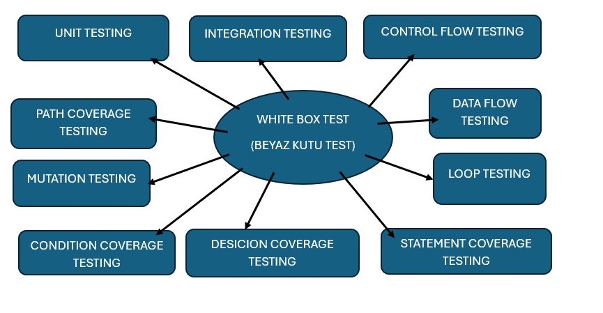
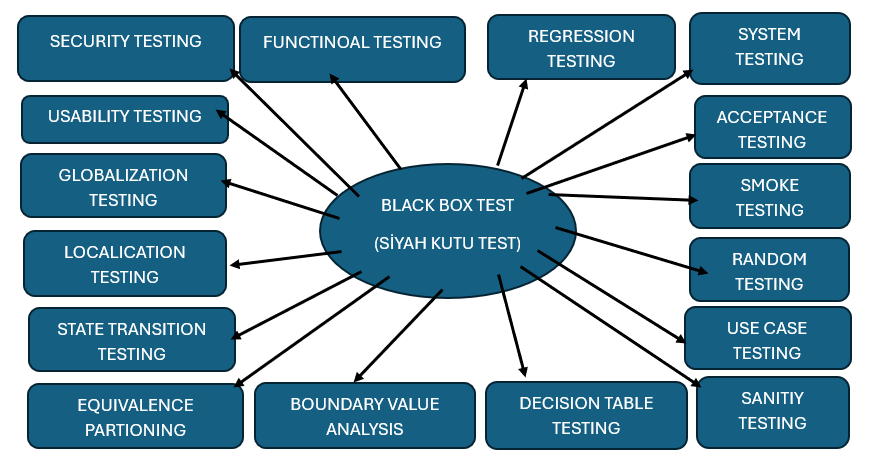

#  Test Teknikleri – White Box & Black Box, Coverage ve Test Tasarım Yöntemleri

Bugünkü odak konularım:
- **White Box Testing** (Şeffaf Kutu Testi)
- **Black Box Testing** (Siyah Kutu Testi)
- **Coverage Techniques** (Statement, Decision, Condition Coverage)
- **Test Design Techniques** (Equivalence Partitioning, Boundary Value Analysis)

Bu teknikler, yazılımın hem **kod seviyesinde** hem de **kullanıcı seviyesinde** test edilmesini sağlar.  
Doğru teknik seçimi, **zaman** ve **maliyet** açısından büyük tasarruf sağlar.

---

## 1. Giriş

- **White Box Testing**: (Şeffaf kutu) Kodun iç yapısı, kontrol akışı, veri akışı ve dallanmaları **içeriden** test eder. Teknik kod ve yorumlama bilgisi gerektirir.  
- **Black Box Testing**: (Siyah kutu) Kaynak kodu bilmeden, yalnızca **girdi–çıktı** ilişkisine göre test eder. Test uzmanı kodu görmez; gereksinimler temel alınır.
- **Test Coverage Teknikleri**: Statement / Decision / Condition kapsama ölçümleri, yazdığımız testlerin **kodu ne kadar çalıştırdığını** ve **mantıksal dalların ne kadarını kapsadığını** objektif olarak gösterir.
- **Test Design Teknikleri**: Equivalence Partitioning ve Boundary Value Analysis ile **daha az testle daha geniş** alan kapsanır.

**Neden önemli?**
- Farklı teknikler, yazılımın **hem içeriden hem dışarıdan** sağlamasını yapar.  
- Doğru teknik seçimi, **erken hata yakalama**, **daha düşük bakım maliyeti** ve **daha yüksek kullanıcı memnuniyeti** getirir.

---

## 2. White Box vs Black Box Testing

### 2.1 White Box Testing (Şeffaf Kutu)

**Tanım:** Kodun iç yapısının ve tasarımının nasıl çalıştığını test eder.  
**Analojim:** Aşçının yaptığı yemeği test etmesi; hangi malzemelerin kullanıldığını, hangi sırayla piştiğini bilerek değerlendirmesi.

**Avantajlar**
- Yazılım döngüsünün **en erken** aşamalarından itibaren uygulanabilir → erken teşhis & müdahale.
- Güvenlik açıkları, ölçeklenebilirlik ve performans **iç mantık** üzerinden tespit edilebilir.
- Kod optimizasyonu ve **temiz kod** alışkanlıklarını teşvik eder.

**Dezavantajlar**
- **Kaynak kod bilgisi** gerekir (uzman profili bulmak zor olabilir).
- Kapsamlı senaryolar **zaman alıcı** olabilir.
- Geliştiricinin kendi kodunu test etmesi **kör noktalar** yaratabilir.

**Örnek**
```python
def topla(a, b):
    if a is None or b is None:
        return 0
    s = a + b
    if s > 100:
        return 100
    else:
        return s
````

* White box testte: `None` kontrolleri, `s > 100` dalı, `else` dalı, dönüş değerleri, sınırlar vb. **iç mantık** hedeflenir.

**Alt Teknikler**

* Unit Testing, Integration Testing (white-box), Control Flow Testing
* Decision/Condition/Branch/Path Coverage
* Loop Testing, Data Flow Testing, Mutation Testing




---

### 2.2 Black Box Testing (Siyah Kutu)

**Tanım:** Kodun iç yapısını bilmeden, sadece **girdi–çıktı** üzerinden test eder.
**Analojim:** Müşterinin bilmediği bir yemeği tadarken, malzemeleri bilmeden tat ve deneyime göre değerlendirmesi.

**Avantajlar**

* Kod bilgisi gerekmez, **farklı bakış açılarından** test yapılabilir.
* Gereksinimler ve kullanıcı akışları **doğrudan** doğrulanır.
* Büyük ölçekli sistemlerde **hızlı ve etkili** geri bildirim sağlar.

**Dezavantajlar**

* İçeride kümelenen hatalar **görünmeyebilir**.
* Tüm olasılıkları test etmek **imkânsız**dır.
* Karmaşık iç mantık hataları atlanabilir.

**Örnek**

```text
Login formu:
- Doğru kullanıcı/şifre → Ana sayfaya yönlendirme
- Yanlış şifre → Anlamlı hata mesajı
- Boş alan → Zorunlu alan uyarısı
```

**Alt Teknikler**

* Functional/System/Acceptance Testing
* Equivalence Partitioning, Boundary Value Analysis
* Decision Table, State Transition, Use Case, Random Testing


---

## 3. Coverage Techniques (Kapsama Teknikleri)

> Kapsama metrikleri, **testlerimizin ne kadarını gerçekten çalıştırdığını** ölçer.
> Kod kalitesi ≠ %100 kapsama; fakat kapsama, **görünmeyen boşlukları** bulmamıza yardım eder.

### 3.1 Statement Coverage

**Tanım:** Kodun **her satırının** en az bir kez çalıştırılması.

**Formül**

```text
Statement Coverage (%) = (Çalıştırılan satır sayısı / Toplam satır sayısı) × 100
```

**Avantaj**

* Hiç çalışmayan satırları ortaya çıkarır (ölü/ulaşılamayan kodları fark ettirir).

**Dezavantaj**

* Tüm mantıksal olasılıkları kapsamaz (ör. else hiç tetiklenmemiş olabilir).

**Örnek Kod & Senaryo**

```python
x = 10
if x > 5:
    print("Büyük")
else:
    print("Küçük")
print("Bitti")
```

* **Sadece** `x = 10` ile test → `if`-True, `else` hiç çalışmıyor → Statement Coverage yüksek görünür ama **dallanmada eksik**.

---

### 3.2 Decision Coverage

**Tanım:** Tüm karar noktalarının (if/switch) **True ve False** sonuçlarının en az bir kez tetiklenmesi.

**Formül**

```text
Decision Coverage (%) = (Gerçekleştirilen karar sonuç sayısı / Toplam karar sonucu sayısı) × 100
```

**Avantaj**

* Karar dallarının **tamamını** hedefler (True/False).

**Dezavantaj**

* Koşullar birden fazlaysa, **her alt koşulu** ayrı ayrı zorlamayabilir (iç mantık kaçabilir).

**Örnek Kod & Test Seti**

```python
y = 4
if y > 3:
    print("3'ten büyük")
else:
    print("3 veya daha küçük")
```

**Testler**

* `y = 4` → True dalı
* `y = 3` → False dalı
  → **%100 Decision Coverage** (True ve False çalıştı).

---

### 3.3 Condition Coverage

**Tanım:** Karar ifadelerindeki **her koşulun** (ör. `a > 3`, `b < 4`) **ayrı ayrı** True/False üretecek biçimde test edilmesi.

**Formül**

```text
Condition Coverage (%) = (Gerçekleştirilen koşul sonuç sayısı / Toplam koşul sonucu sayısı) × 100
```

**Avantaj**

* Her bir alt koşul **bağımsız** doğrulanır (gizli mantık hataları görünür olur).

**Dezavantaj**

* Test sayısı artar; kombinasyon patlaması olabilir.

**Örnek Kod & Test Seti**

```python
def kontrol(a, b):
    if (a > 3) and (b < 4):
        return "OK"
    return "NO"
```

Koşullar: `C1 = (a > 3)`, `C2 = (b < 4)`
**Amaç:** C1 için True/False, C2 için True/False **ayrı ayrı** görülmeli.

Önerilen testler:

* `a=5, b=2` → C1=True,  C2=True  → "OK"
* `a=5, b=6` → C1=True,  C2=False → "NO"
* `a=1, b=2` → C1=False, C2=True  → "NO"
* `a=1, b=6` → C1=False, C2=False → "NO"

→ **%100 Condition Coverage** (her koşul hem True hem False oldu).

---

## 4. Test Design Techniques (Test Tasarım Yöntemleri)

### 4.1 Equivalence Partitioning (Eşdeğer Bölümleme)

**Tanım:** Girdileri **geçerli** ve **geçersiz** **bölümlere** (partition) ayırıp, her bölgeden **temsilci** değer test etmek.

**Avantaj**

* Test sayısını önemli ölçüde **azaltır**, verimliliği artırır.

**Dezavantaj**

* Özel/aykırı değerler gözden kaçabilir.

**Örnek**

```text
Yaş alanı: 18–60
Geçerli bölüm: [18..60] → örn. 25
Geçersiz bölümler: (-∞..17), (61..+∞) → örn. 15, 70
```

---

### 4.2 Boundary Value Analysis (Sınır Değer Analizi)

**Tanım:** Hataların çoğu **sınırda** çıkar; bu yüzden sınır ve sınırın **hemen yanındaki** değerler test edilir.

**Avantaj**

* En kritik hataları **düşük sayıda testle** yakalar.

**Dezavantaj**

* Sınır dışındaki nadir hataları **yakalamaz**.

**Örnek**

```text
Yaş alanı: 18–60
Test seti: 17, 18, 19  ve  59, 60, 61
```

---

## 5. Kapanış

* **White Box** ile iç mantığı, **Black Box** ile kullanıcı/iş gereksinimlerini doğruladım.
* **Coverage metrikleri** sayesinde hangi kod kısımlarının **boşta kaldığını** ölçebiliyorum (Statement/Decision/Condition).
* **EP** ve **BVA** ile **daha az test** yazarak **daha yüksek kapsama** elde etmeyi hedefliyorum.

Kendimi bir **developer** olarak gördüğüm için **White Box Testing** bana daha yakın; ancak sürdürülebilir kalite için **her iki yaklaşımı** da birlikte kullanmanın şart olduğunu net biçimde gördüm.
Bundan sonra mimari ve gereksinimler anlaşılır anlaşılmaz test sürecini başlatacağım.

---